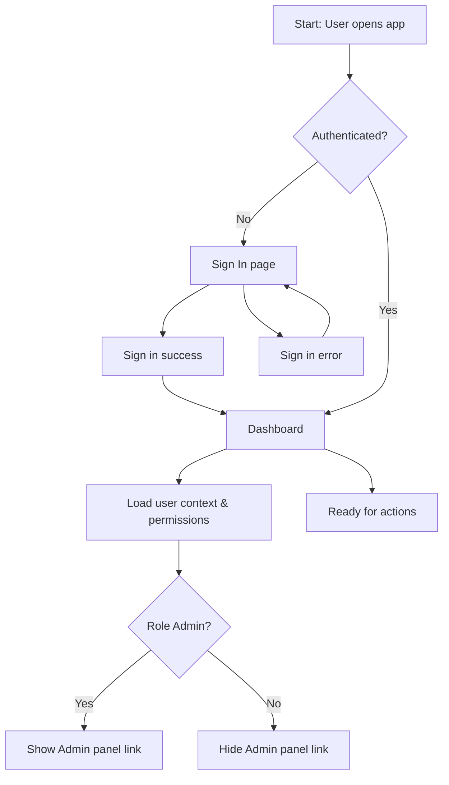
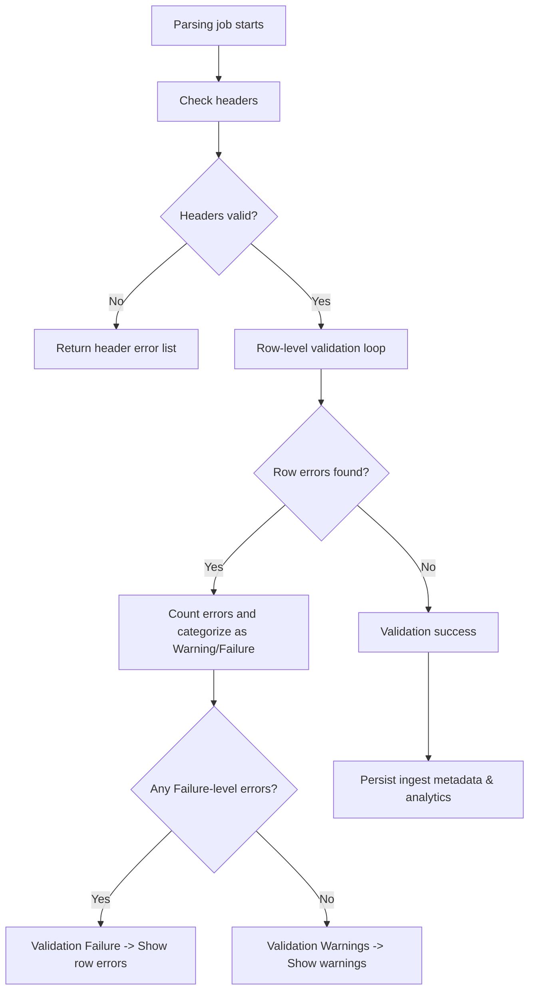
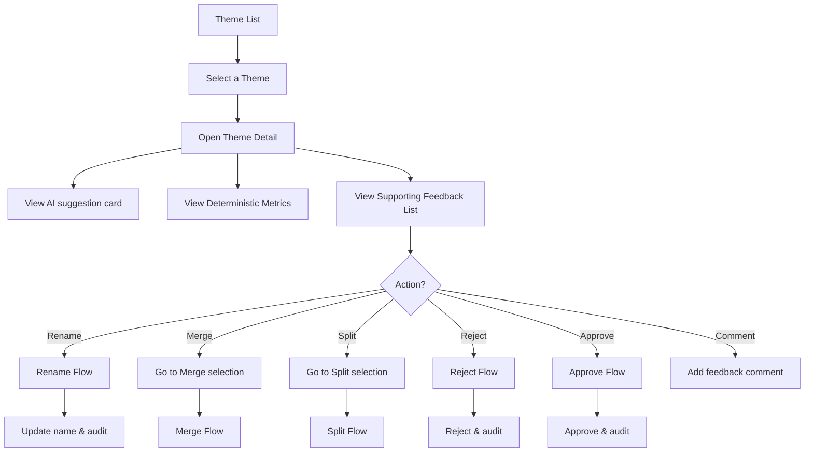
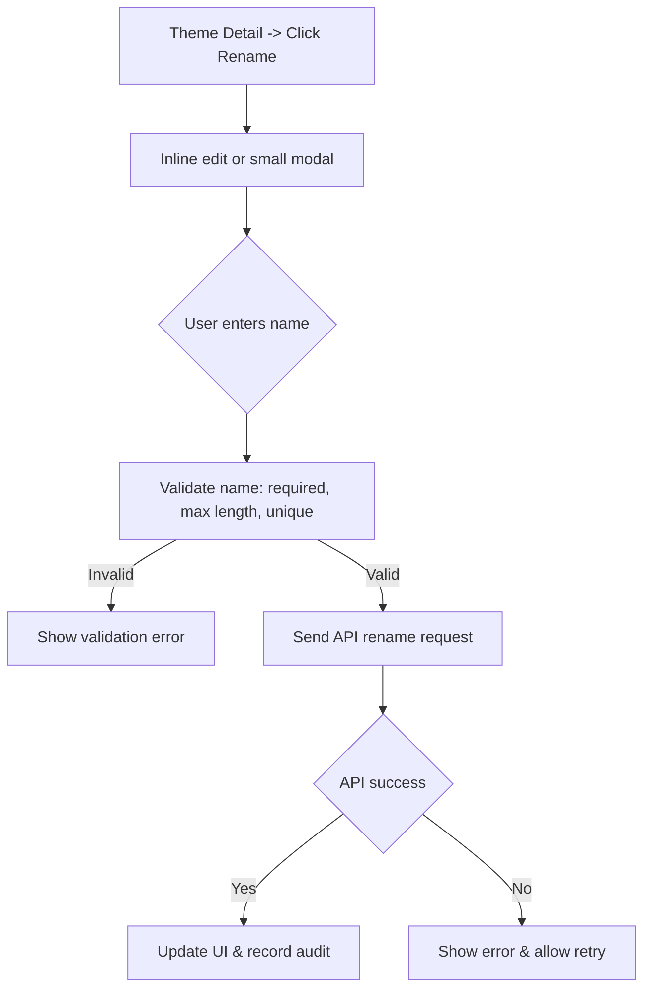
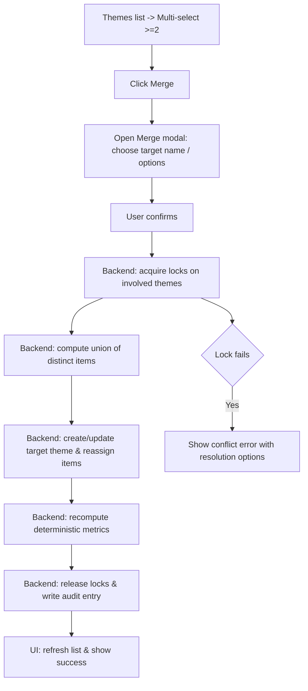
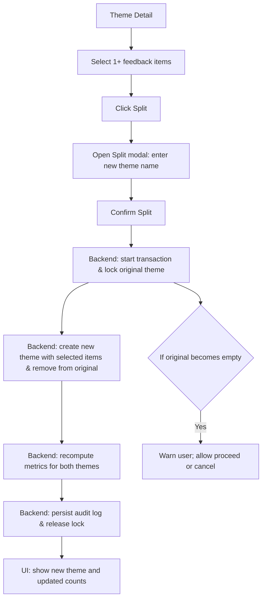
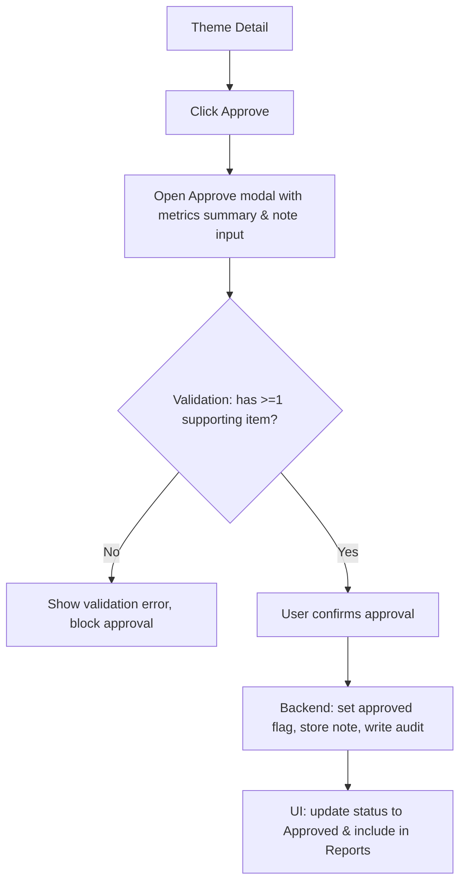

# User Flow Document

Project: AI Product Feedback Synthesis Assistant (MVP)

Date: 2026-07-29

This document contains complete user flows for the MVP. Each flow is presented as a Mermaid flowchart plus a plain-text step-by-step flow with explanations. Use these for design, engineering, QA, and documentation.

---

## 1. Application Entry Flow

Mermaid diagram



Plain-text steps and explanations

1. Start: User navigates to the application URL.
2. Check authentication: If the user has an active session (cookie or JWT), move to Dashboard; otherwise present Sign In page.
3. Sign In: User enters credentials or signs in via SSO. On success, redirect to Dashboard.
4. On sign-in error, show an inline error and allow retry.
5. On Dashboard load, the app fetches user context and permissions and renders UI accordingly (Admin-only links shown to Admins).
6. User is now ready to perform actions (Upload CSV, view Themes, Reports).

Notes
- Keep sign-in flow secure with TLS and CSRF protection.
- Support deep-linking: if user navigates directly to an ingest detail link and is not authenticated, after sign-in redirect back.

---

## 2. CSV Upload Flow

Mermaid diagram

```mermaid
flowchart TD
  A[Dashboard -> Click Upload CSV] --> B[Upload page displayed]
  B --> C{Choose file via drag/drop or file picker}
  C --> D[Client uploads file to server]
  D --> E[Server stores immutable snapshot and returns ingest job id]
  E --> F[Show preview (first 10 rows)]
  F --> G[Trigger validation & parsing job]
  G --> H{Validation result}
  H -- Success --> I[Ingest status: Ready -> Redirect to Ingest Detail]
  H -- Warnings --> J[Show warnings panel]
  J --> K{User action}
  K -- Fix & Retry --> C
  K -- Continue with Warnings --> I
  H -- Failure --> L[Show validation errors with rows]
  L --> M[User fixes CSV locally and re-uploads]
```

Plain-text steps and explanations

1. From Dashboard, user clicks "Upload CSV" and lands on the Upload page.
2. User chooses file (drag/drop or file picker), optionally fills ingest title and description.
3. Client transmits file to server; server stores an immutable snapshot in object storage and returns an ingest job id.
4. UI displays a preview of the first 10 rows for quick confirmation.
5. Server enqueues a parsing/validation job that checks headers, date formats, and required fields.
6. Validation result paths:
   - Success: Ingest status moves to Ready; UI redirects to Ingest Detail where deterministic analytics are available.
   - Warnings (non-blocking issues): show warnings panel with option to "Fix & Retry" (user downloads error report and re-uploads after fix) or "Continue with Warnings" (user accepts risk and proceeds). Continuing still stores the snapshot and allows AI analysis.
   - Failure (blocking errors): show list of row-level errors with row numbers and messages; user must fix and re-upload.

Notes
- Keep uploads resumable for large files; chunking optional for MVP but recommended for reliability.
- Provide sample CSV and accepted header synonyms in UI.

---

## 3. Validation Flow

Mermaid diagram



Plain-text steps and explanations

1. Start parsing job: verify file integrity and header row.
2. Header validation: confirm required columns exist (feedback text, source, user type, product area, date). If headers are missing or invalid, return header error list (blocking).
3. Row-level validation: iterate rows and validate non-empty required fields, parseable date, optional rating numeric if present.
4. Collect row errors and classify each as Warning (minor, e.g., missing optional rating) or Failure (required field missing, unparsable date).
5. If any Failure-level errors exist, mark validation as Failure and show row errors in UI; block AI analysis until user fixes.
6. If only Warnings, mark validation as Warnings: store warnings and let user either proceed with caution or fix data.
7. On Validation success, persist ingest metadata and proceed to deterministic analytics.

Notes
- Provide an exportable error report (CSV) listing row numbers and error messages for faster local fixes.
- Treat unexpected formats conservatively — prefer warnings over silent coercion.

---

## 4. AI Analysis Flow

Mermaid diagram

```mermaid
flowchart TD
  A[Ingest Detail] --> B{AI feature flag enabled?}
  B -- No --> C[AI controls hidden; user can enable in Admin]
  B -- Yes --> D[User triggers AI analysis or auto-start]
  D --> E[Enqueue AI job]
  E --> F[Worker picks job: Preprocess -> Embeddings -> Clustering]
  F --> G[LLM call: Draft problem statements & explanations]
  G --> H{LLM success?}
  H -- Yes --> I[Persist AI suggestions (themes, snippets, metadata)]
  I --> J[Notify UI: AI job complete]
  H -- No --> K[Persist error log -> Notify UI: AI failed]
  J --> L[Open Theme Review page with suggested themes]
```

Plain-text steps and explanations

1. At Ingest Detail, if AI feature flag is enabled, the user may trigger AI analysis manually or the system may auto-start it (configurable).
2. The app enqueues an AI job in the background queue. The job includes ingest id and configuration (e.g., number of clusters, similarity thresholds).
3. Worker preprocesses text, computes embeddings (if used), performs clustering, and prepares candidate groups.
4. Worker calls LLM to draft concise problem statements and explanation for each cluster; LLM outputs include confidence metadata.
5. On success, persist AI outputs (suggested theme label, problem statement, supporting snippet row ids, model metadata, timestamps) in DB and record them as suggestions (not authoritative).
6. Notify the UI (via websocket or polling) that AI job is complete. The user navigates to Theme Review to inspect suggestions.
7. If LLM call fails, persist structured error logs and surface a retriable failure in UI with suggested remediation.

Security & privacy step
- Before sending text to external LLM, redact PII fields or obey Admin policy; log what is sent.

Notes
- Ensure AI outputs are labeled clearly and never auto-approved.
- Keep LLM prompt and versioning metadata for AGENT_USAGE and auditing.

---

## 5. Theme Review Flow

Mermaid diagram



Plain-text steps and explanations

1. Analyst opens Theme Review page which shows a left list of themes and a selected theme detail center column.
2. Selecting a theme shows AI suggestion (labeled), authoritative metrics (member count, distribution), and full supporting feedback list (with selection checkboxes and comments).
3. Analyst may perform actions:
   - Rename: update label inline; saved to DB with audit log.
   - Merge: choose multiple themes and invoke Merge Flow.
   - Split: select items and invoke Split Flow.
   - Reject: mark as rejected; reason required and recorded.
   - Approve: confirm approval (modal) and add optional note; recorded.
   - Comment: add reviewer comment on the theme or on individual feedback items.
4. After each action, UI displays updated metrics, and the audit log is appended.

Notes
- All actions must be transactional to prevent inconsistent counts.
- Changes to theme membership recompute deterministic metrics server-side and are authoritative.

---

## 6. Theme Rename Flow

Mermaid diagram



Plain-text steps and explanations

1. Analyst clicks Rename in Theme Detail; an inline editable field or small modal appears prefilled with the current name.
2. Analyst edits name and saves; client validates (non-empty, <=200 chars, no duplicate within same dataset).
3. On valid input, client sends rename request to API which updates DB and writes audit record (old name, new name, user, timestamp).
4. On success, UI updates across list/detail and export; on failure, show inline error and option to retry.

Notes
- Prevent accidental whitespace-only names; trim input on save.

---

## 7. Theme Merge Flow

Mermaid diagram



Plain-text steps and explanations

1. Analyst selects two or more themes in the Themes list and clicks Merge.
2. Merge modal opens allowing choice of a target name (pre-filled) and options (preserve original names in audit notes).
3. Analyst confirms merge.
4. Backend starts a transactional operation:
   - Acquire locks for the involved themes to prevent concurrent edits.
   - Compute the union of unique feedback item ids (deduplicate if an item was in multiple themes).
   - Create or update the target theme with the union set, reassign member references, and mark source themes as merged or deprecated as per option.
   - Recompute deterministic metrics for the target and affected sets.
   - Release locks and write a comprehensive audit entry listing source theme ids, new target id, user, and timestamp.
5. UI refreshes to reflect the merged theme and shows a success notification.

Error handling
- If lock acquisition fails due to concurrent edits, abort and show merge conflict dialog linking to current states of the themes to allow manual resolution.

Notes
- Keep merge operations idempotent: if retry occurs after a partial success, ensure no duplicate members and no loss of data.

---

## 8. Theme Split Flow

Mermaid diagram



Plain-text steps and explanations

1. Analyst opens Theme Detail and selects one or more feedback items in the supporting list.
2. Analyst clicks Split and a modal prompts for new theme name and optional description.
3. Analyst confirms. Backend locks the original theme, creates the new theme with the selected item ids, removes those items from the original membership, recomputes deterministic metrics for both themes, persists changes, and writes audit entries.
4. On success, UI displays the new theme (selected) and updated counts. If the original theme becomes empty as a result, warn the user (allow proceed or cancel) — prefer to allow and mark original as empty with a suggestion to delete or rename.

Edge cases
- If user selects all items, confirm and warn.
- If concurrent edits occur, transaction rollback with conflict message.

---

## 9. Theme Approval Flow

Mermaid diagram



Plain-text steps and explanations

1. Analyst clicks Approve on a theme; an Approve modal opens showing a brief metrics summary and optional note field.
2. System validates that the theme has at least one supporting feedback item. If not, show an inline error and block approval.
3. If validation passes, analyst confirms; backend sets approved flag, stores optional note, writes audit record with user/timestamp, and ensures theme is included in saved reports/exports.
4. UI updates to show Approved status and success toast.

Notes
- Only Analyst or Admin roles may approve.
- Approval is final for the saved report but can be reverted if necessary (record revert in audit).

---

## 10. Report Generation Flow

Mermaid diagram

```mermaid
flowchart TD
  A[Themes List -> Select Approved Themes] --> B[Click "Save Report"]
  B --> C[Open Save Report modal: enter title & description]
  C --> D{Validation: >=1 approved theme selected}
  D -- No --> E[Show validation error]
  D -- Yes --> F[Backend: create report entity & snapshot themes]
  F --> G[Persist report JSON & CSV generation in background]
  G --> H{Export formats selected}
  H -- JSON/CSV --> I[Prepare files & return download links]
  H -- PDF --> J[Queue PDF generation (optional)]
  I --> K[UI: show "Report saved" & links to downloads]
```

Plain-text steps and explanations

1. Analyst selects one or more approved themes (or uses "Include all approved") and clicks "Save Report".
2. Save Report modal requests a title and optional description; validation requires at least one approved theme.
3. On confirm, backend snapshots the selected themes and their deterministic metrics and citations into a report entity; report generation for JSON/CSV may be synchronous or queued depending on size; PDF generation is queued as optional.
4. When exports are ready, provide download links and show the saved report in the Reports list with metadata.
5. Reports are versioned: if underlying themes change and analyst wants to regenerate, Save Report will create a new snapshot/version.

Notes
- Include audit excerpt in export metadata by default; allow toggle to omit for privacy.

---

## 11. Error Recovery Flow

Mermaid diagram

```mermaid
flowchart TD
  A[Action triggers error] --> B{Error type}
  B -- Network --> C[Show "Network error" toast & retry button]
  B -- Validation --> D[Show validation modal with errors and links to fix]
  B -- Concurrency/Lock --> E[Show conflict dialog with options: Retry / View current state / Cancel]
  B -- LLM failure --> F[Persist LLM error -> Notify user with remediation: Retry / Turn off AI]
  B -- System failure --> G[Show friendly error & "Contact support" link with error id]
  C --> H[User retries action]
  D --> I[User fixes input and retries]
  E --> J[User resolves conflict or cancels]
  F --> K[User retries AI job or disables AI]
  G --> L[Support ticket created if user chooses]
```

Plain-text steps and explanations

1. On any operation error, classify error type and present appropriate recovery UI:
   - Network error: show transient toast with "Retry" and automatic exponential backoff for background tasks.
   - Validation error: show detailed messages, row numbers, and an action to download an error report for local fixing.
   - Concurrency/lock error: show conflict dialog that surfaces current state and provides option to retry, view conflicting resource, or cancel.
   - LLM/AI failure: show error with retry and "Turn off AI" options (Admin may toggle feature flag).
   - System failure: show friendly message with an error id, and an option to open support contact modal that includes the error id for faster triage.
2. Provide automatic logging of error details for support and debugging.

Notes
- Aim for graceful degradation: deterministic analytics and theme operations should continue even if AI services are unavailable.

---

## 12. Navigation Flow

Mermaid diagram

```mermaid
flowchart TD
  A[Global Nav]
  A --> Dashboard[Dashboard]
  A --> Upload[Upload CSV]
  A --> Themes[Themes]
  A --> Reports[Reports]
  A --> Admin[Admin (if role==Admin)]
  Dashboard --> IngestDetail[Ingest Detail]
  IngestDetail --> AIAnalysis[AI Analysis Progress]
  AIAnalysis --> ThemeReview[Theme Review]
  ThemeReview --> ThemeDetail[Theme Detail]
  ThemeDetail --> Split[Split flow]
  ThemeDetail --> Merge[Merge flow]
  ThemeDetail --> Approve[Approve flow]
  Reports --> ReportDetail[Report Detail]

  subgraph Shortcuts
    SD[Ctrl+G, D -> Dashboard]
    SU[Ctrl+G, U -> Upload]
    ST[Ctrl+G, T -> Themes]
    SR[Ctrl+G, R -> Reports]
  end

  Shortcuts --> Dashboard
  Shortcuts --> Upload
  Shortcuts --> Themes
  Shortcuts --> Reports
```

Plain-text steps and explanations

1. Global navigation provides access to Dashboard, Upload CSV, Themes, Reports, and Admin (if applicable).
2. Dashboard lists ingests and provides links to Ingest Detail pages.
3. From Ingest Detail, users can launch AI Analysis Progress view and then move to Theme Review when complete.
4. Theme Review is the main curation workspace; from a Theme Detail users can invoke Split, Merge, Rename, Approve, and Reject flows.
5. Reports list previously saved synthesis reports and allow opening report details for export.
6. Keyboard shortcuts provide quick navigation to main areas.

Notes
- Maintain strong affordances for returning to previous views and consistent bread-crumbs for context.

---

# Handoff & QA Notes

- Include the flow diagrams in design handoff artifacts and the engineering ticket descriptions.
- Each flow step that calls backend operations must correspond to a documented API endpoint and a test case.
- Provide sample CSVs to exercise validation edge cases for QA.
- For LLM-dependent flows, provide mock endpoints to enable local/dev testing when LLM providers are unavailable.

---

End of document.
